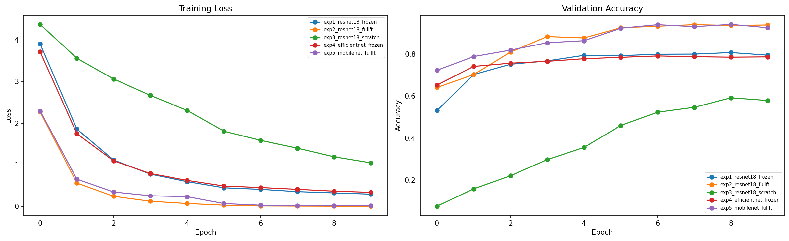

# 🎮 MyPocket

Pokemon image classifier using transfer learning with PyTorch.

## 실험 결과
| 실험 | Backbone | Fine-tuning | Pretrained | Accuracy | Precision | Recall |
|------|----------|-------------|------------|----------|-----------|--------|
| exp1 | ResNet18 | 마지막층만 | ✅ | 0.7947 | 0.8079 | 0.7980 |
| exp2 | ResNet18 | 전체 | ✅ | 0.9384 | 0.9431 | 0.9396 |
| exp3 | ResNet18 | 전체 | ❌ | 0.5784 | 0.6161 | 0.5911 |
| exp4 | EfficientNet-B0 | 마지막층만 | ✅ | 0.7867 | 0.8028 | 0.7846 |
| exp5 | MobileNetV2 | 전체 | ✅ | 0.9252 | 0.9288 | 0.9294 |

## Learning Curve


## 예측 예시


## 데모 실행
```bash
pip install streamlit torch torchvision
streamlit run app.py
```
## 데모 GUI 스크린샷 
![demo]_(demo.png)
